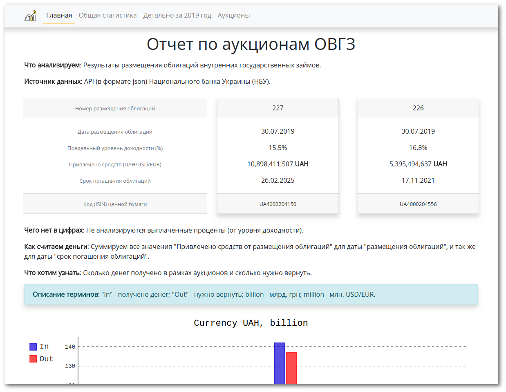
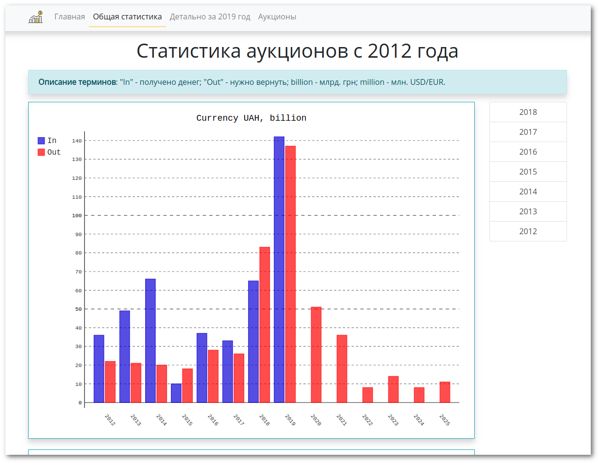
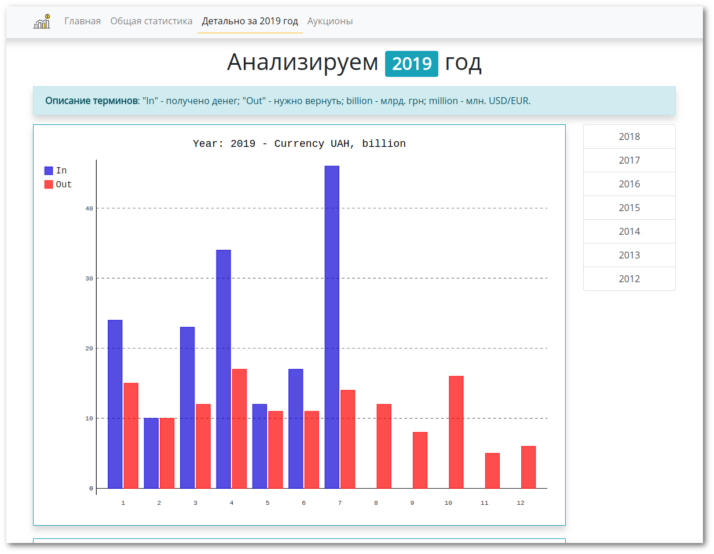
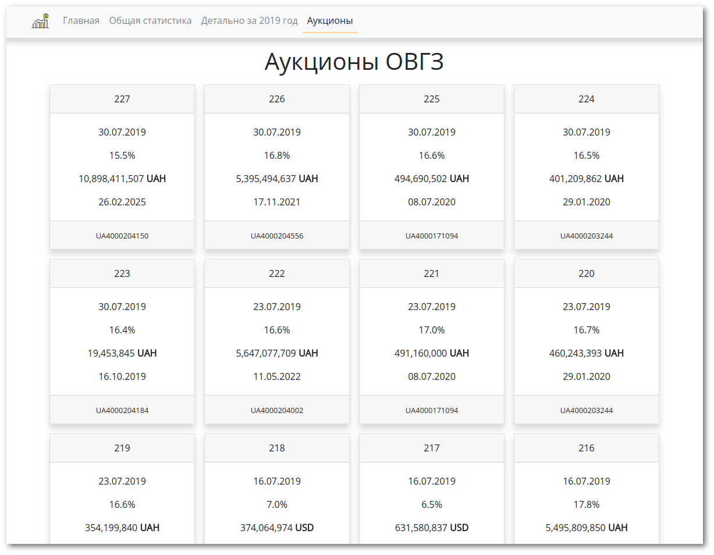

# OVDPs website (Flask framework)

**Что анализируем**: Результаты размещения облигаций внутренних государственных займов.

**Источник данных**: API (в формате json) Национального банка Украины (НБУ).

Проект состоит из двух частей - загрузки данных (конвертации и записи в БД sqlite3) и отображения на сайте.

За загрузку отвечает `run_loader.py` - исполняемый файл, запускаемый по крону.

За запуск приложения отвечает `run_server.py` (Flask framework).

```
www-ovdp/
 ├── venv/
 ├── instance/
 │    ├── logs/
 │    └── local_settings.py
 ├── run_server.py
 ├── run_loader.py
 ├── loader.py
 ├── utils_load.py
 └── ovdp/
      ├── static/
      │    └── reports/
      ├── templates/
      ├── __init__.py
      ├── default_settings.py
      ├── views.py
      ├── utils_app.py
      ├── queries.py
      └── auctions.db
```

Конфигурационные данные подгружаются из двух файлов - `default_settings.py` и `local_settings.py` - через опцию `instance_relative_config` в `__init__.py` приложения.

```python
from flask import Flask

app = Flask(__name__, instance_relative_config=True)
app.config.from_object('ovdp.default_settings')
app.config.from_pyfile('local_settings.py', silent=True)
```

## Внешний вид (Centos 7 + nginx + uwsgi)





